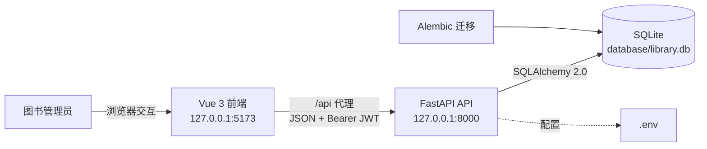
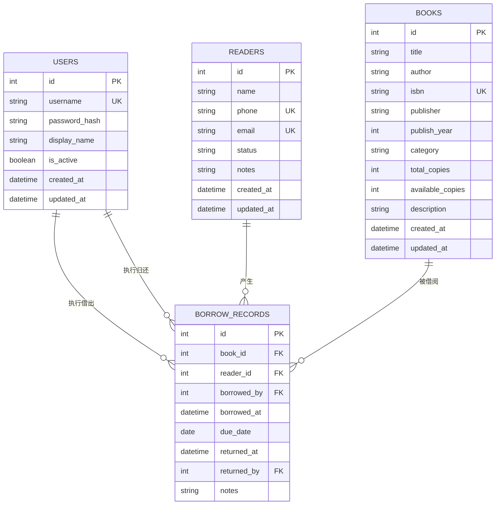
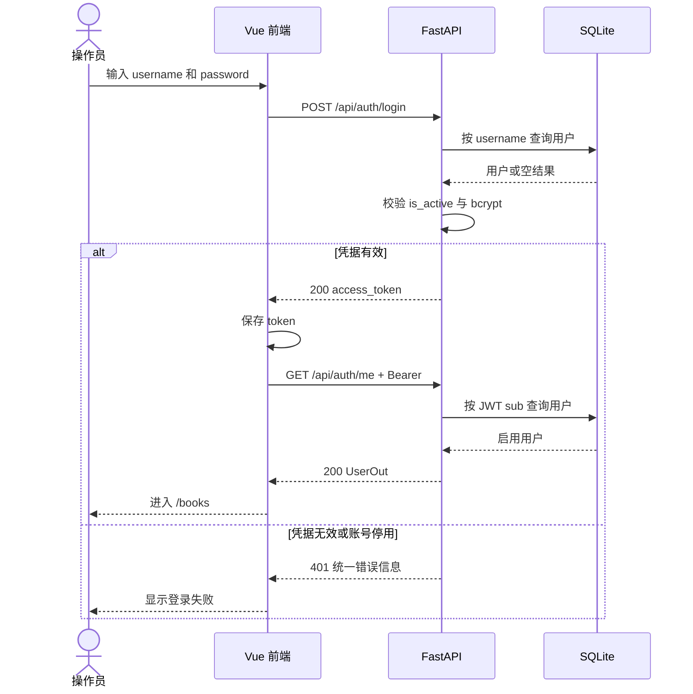
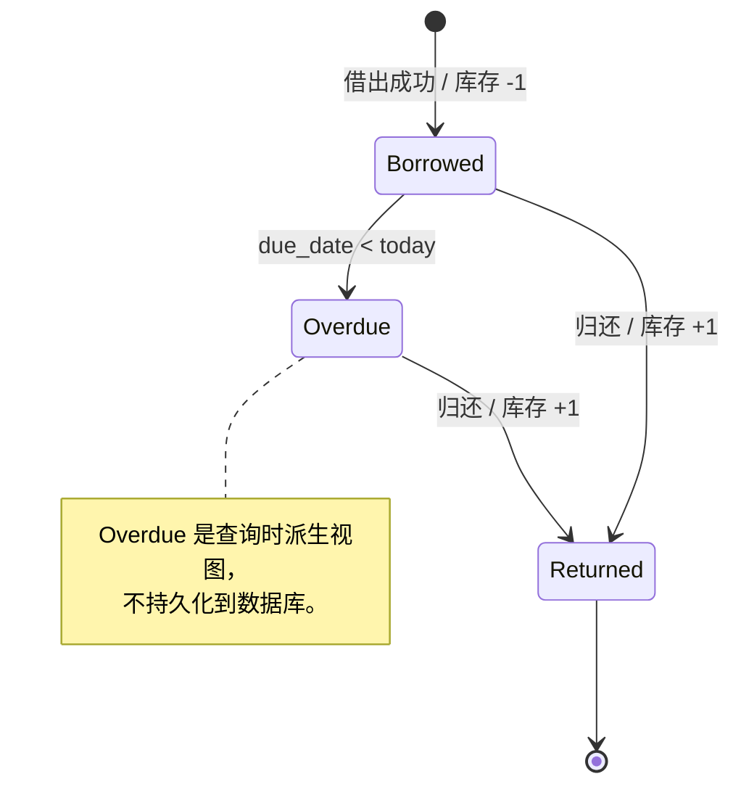

# 图书管理员系统总体设计

| 项目 | 内容 |
|---|---|
| 文档版本 | 1.0 |
| 基线日期 | 2026-08-18 |
| 状态 | MVP 设计基线 |
| 负责人 | GPT Sol（总体设计与整合） |
| 评审角色 | GPT Luna（后端）、Kimi（前端）、DeepSeek（测试） |
| 适用范围 | 用户登录、图书管理、读者管理与借阅管理 MVP |

## 1. 文档约定

### 1.1 目的

本文档是图书管理员系统的统一设计契约，用于指导后端、前端和测试协作者并行实现。项目概况与协作边界分别以 [`../README.md`](../README.md)、[`../CLAUDE.md`](../CLAUDE.md) 和 [`agent-responsibilities.md`](agent-responsibilities.md) 为依据；发生跨模块歧义时，以本文档中的编号决策和接口契约为准。

本文档使用以下标记：

- **【当前实现】**：能够从当前工作树中的代码或配置直接验证的事实。
- **【目标设计】**：本轮 MVP 必须实现并共同遵循的契约。
- **【暂缓事项】**：明确不进入本轮 MVP，后续必须重新评审才能实施的能力。

任何影响数据字段、API、错误语义、权限或业务规则的变更，应先更新本文档并由 GPT Sol 决策，再由相应协作者修改实现和测试。

### 1.2 术语

| 术语 | 定义 |
|---|---|
| 操作员 | 登录系统并执行管理操作的图书管理员，对应 `users` 实体。 |
| 读者 | 被登记和管理的借阅对象，对应 `readers` 实体；MVP 中不登录系统。 |
| 图书 | 一条书目及其馆藏数量，对应 `books` 实体。 |
| 借阅记录 | 一次图书借出及归还的完整记录，对应 `borrow_records` 实体。 |
| 未归还 | `returned_at IS NULL` 的借阅记录。 |
| 逾期 | 未归还且 `due_date` 早于当前业务日期的借阅记录。 |
| 可用库存 | 当前可立即借出的馆藏数量，即 `books.available_copies`。 |

## 2. 范围与现状

### 2.1 MVP 范围

**【目标设计】** MVP 包含：

1. 操作员登录、获取当前操作员信息以及维护操作员账号。
2. 图书的检索、分页、新增、查看、编辑和受保护删除。
3. 读者档案的检索、分页、新增、查看、编辑、停用和受保护删除。
4. 借阅记录的检索、分页、借出、查看和归还。
5. 库存、借阅上限、逾期限制和删除保护等一致性规则。
6. 前端登录页、主布局、图书页、读者页、借阅页和操作员页。
7. 后端单元与 API 集成测试，以及前端类型检查和生产构建验证。

### 2.2 当前实现基线

**【当前实现】** 当前工作树处于脚手架阶段，业务模块尚未实现。

| 区域 | 已有能力 | 主要缺口 | 事实来源 |
|---|---|---|---|
| 后端应用 | FastAPI 应用工厂、开发 CORS、健康检查路由 | 无认证、业务路由、全局业务异常规范 | [`../backend/app/main.py`](../backend/app/main.py)、[`../backend/app/routers/health.py`](../backend/app/routers/health.py) |
| 配置 | `app_name`、`environment`、`database_url`，支持 `.env` | 无认证、分页、借阅规则与 CORS 配置项 | [`../backend/app/core/config.py`](../backend/app/core/config.py)、[`../.env.example`](../.env.example) |
| 数据库 | SQLAlchemy 2.0 的 `Base`、`engine`、`SessionLocal`、`get_db()` | 无业务模型、迁移、种子数据和数据库文件 | [`../backend/app/database/session.py`](../backend/app/database/session.py) |
| 认证依赖 | 已声明 `python-jose` 和 `passlib[bcrypt]` | 依赖尚未被代码使用 | [`../backend/requirements.txt`](../backend/requirements.txt) |
| 前端 | Vue 3、TypeScript、Element Plus 占位页；依赖已声明 Router、Pinia、axios | 无页面、路由、store、API 层和代理 | [`../frontend/package.json`](../frontend/package.json)、[`../frontend/src/App.vue`](../frontend/src/App.vue)、[`../frontend/vite.config.ts`](../frontend/vite.config.ts) |
| 测试 | Settings 单元测试与 `/api/health` 集成测试 | 无 fixture、测试数据库和业务测试 | [`../tests/test_settings.py`](../tests/test_settings.py)、[`../tests/test_health.py`](../tests/test_health.py) |
| Git 基线 | `main` 作为整合分支，已规定工作树职责 | 当前应用骨架和本文档所在目录仍含未跟踪内容，应先建立基线再并行开发 | [`agent-responsibilities.md`](agent-responsibilities.md) |

当前唯一业务无关端点为：

```http
GET /api/health
```

当前返回示例：

```json
{
  "status": "ok",
  "service": "library-system",
  "environment": "development"
}
```

### 2.3 暂缓事项

**【暂缓事项】** 以下能力不属于 MVP：

- 读者自助注册、登录和个人中心；
- 多角色 RBAC、细粒度权限与部门隔离；
- 刷新令牌、服务端登出、JWT 黑名单；
- 预约、续借、罚款、催还和遗失处理；
- 多分馆、单册条码、馆藏批次和调拨；
- 报表、数据导出、审计日志和消息通知；
- 前端 Playwright/Cypress E2E；
- Docker 化、生产部署和 PostgreSQL 正式切换。

## 3. 总体架构

### 3.1 逻辑架构

**【目标设计】** 系统采用浏览器前端、HTTP API、关系数据库三层结构。开发环境由 Vite 将 `/api` 请求代理到 FastAPI；生产部署方式不在 MVP 范围内。



### 3.2 技术选型

| 层级 | 技术 | 采用方式 |
|---|---|---|
| 前端 | Vue 3 Composition API、TypeScript | 页面和组件使用 `<script setup>`，开启严格类型检查。 |
| UI | Element Plus | 沿用当前全局注册；MVP 不新增 UI 框架。 |
| 路由 | Vue Router 4 | 业务页使用认证守卫和懒加载。 |
| 状态 | Pinia | 只将认证状态置于全局 store，列表查询状态留在页面内。 |
| HTTP | axios | 统一实例、Bearer 注入、401 处理和错误格式化。 |
| 后端 | FastAPI、Pydantic | 应用工厂、依赖注入、类型化请求与响应。 |
| ORM | SQLAlchemy 2.0 | 声明式模型和显式事务边界。 |
| 认证 | python-jose、passlib/bcrypt | JWT Bearer 和密码哈希。 |
| 数据库 | SQLite | MVP 默认；避免使用 SQLite 专属字段类型。 |
| 迁移 | Alembic | 从首个业务模型开始维护迁移版本。 |
| 测试 | pytest、FastAPI TestClient | 单元测试和 API 集成测试。 |

### 3.3 模块与 Owner

| 模块 | 主要目录 | Owner | 评审重点 |
|---|---|---|---|
| 总体契约与整合 | `docs/`、`main` | GPT Sol | 范围、跨模块一致性、最终验收 |
| 后端与数据库 | `backend/`、迁移文件、后端依赖 | GPT Luna | 模型、认证、事务、API、后端自测 |
| 前端 | `frontend/` | Kimi | 页面、路由、状态、API 调用、构建 |
| 独立测试 | `tests/` | DeepSeek | 权限、边界、异常、数据一致性、回归 |

## 4. 架构决策记录

**【目标设计】** 下表为本轮 MVP 的冻结决策。

| ID | 决策 | 结果 |
|---|---|---|
| D-01 | 登录角色 | 系统只有一种登录主体：操作员。所有启用的操作员拥有相同管理能力，不建立 `role` 字段。 |
| D-02 | 读者定位 | 读者是借阅对象档案，不是登录主体。 |
| D-03 | 初始账号 | 不开放注册；通过后续 `backend/scripts/seed_admin.py` 和环境变量创建首个操作员。 |
| D-04 | 认证 | 使用 HS256 JWT Bearer，access token 默认有效期 1440 分钟；不提供 refresh token。 |
| D-05 | 密码 | 使用 passlib/bcrypt 哈希；明文密码至少 8 个字符，永不记录日志或返回客户端。 |
| D-06 | 响应 | 成功使用原生 HTTP 状态码和 Pydantic 响应模型；错误使用 FastAPI `detail`；不增加通用业务信封。 |
| D-07 | 分页 | `page` 从 1 开始，`page_size` 默认 20、上限 100；返回 `items/total/page/page_size/pages`。 |
| D-08 | 前后端连接 | 开发环境使用 Vite `/api` proxy；FastAPI 保留可配置的开发 CORS origins。 |
| D-09 | 数据库 | MVP 使用 SQLite，模型和查询保持 PostgreSQL 可迁移性。 |
| D-10 | 迁移 | 从首个业务模型开始使用 Alembic；生产和开发建表以迁移为准，测试可使用 `metadata.create_all()`。 |
| D-11 | 借期 | 默认借期 30 天；操作员可提供不早于当前日期的 `due_date`。 |
| D-12 | 借阅限制 | 每位读者最多同时拥有 5 条未归还记录；存在逾期未还记录时禁止继续借阅。 |
| D-13 | 逾期 | 逾期为查询时派生状态，不持久化 `overdue` 字段，不运行定时任务。 |
| D-14 | 库存 | `available_copies` 是事务内维护的冗余计数，借出和归还必须与借阅记录原子提交。 |
| D-15 | 删除 | 图书和读者仅在没有借阅历史时允许硬删除，存在历史则返回 409；操作员账号不提供删除端点，仅通过 `is_active` 停用。 |
| D-16 | 时间 | 时间戳以 UTC 存储并以 ISO 8601 返回；到期日使用 `date`。 |

## 5. 数据设计

### 5.1 实体关系



`BORROW_RECORDS.borrowed_by` 必填，`returned_by` 可空；二者均引用 `USERS.id`。所有业务表使用整数自增主键。

### 5.2 `users`

| 字段 | 类型 | 可空 | 约束与说明 |
|---|---|---:|---|
| `id` | integer | 否 | 主键，自增。 |
| `username` | varchar(64) | 否 | 唯一、索引；匹配 `^[A-Za-z0-9_]{3,64}$`。 |
| `password_hash` | varchar(255) | 否 | bcrypt 哈希，只在服务端使用。 |
| `display_name` | varchar(64) | 是 | 页面展示名称。 |
| `is_active` | boolean | 否 | 默认 `true`；停用后不能登录或继续调用 API。 |
| `created_at` | datetime | 否 | UTC，创建时写入。 |
| `updated_at` | datetime | 否 | UTC，更新时写入。 |

约束：

- 不提供公开注册和用户删除。
- 不允许通过 API 停用当前登录账号。
- 不允许停用最后一个启用的操作员；违反时返回 409，避免系统失去可登录账号。
- 更换密码后旧 JWT 在过期前仍可被解码；MVP 接受该限制，停用账号会在每次鉴权查库时立即生效。

### 5.3 `readers`

| 字段 | 类型 | 可空 | 约束与说明 |
|---|---|---:|---|
| `id` | integer | 否 | 主键，自增。 |
| `name` | varchar(50) | 否 | 去除首尾空白后长度 1–50。 |
| `phone` | varchar(32) | 是 | 非空值唯一；MVP 只做长度校验，不绑定国家格式。 |
| `email` | varchar(254) | 是 | 非空值唯一，使用 Pydantic 邮箱校验。 |
| `status` | varchar(16) | 否 | `active` 或 `disabled`，默认 `active`。 |
| `notes` | varchar(2000) | 是 | 内部备注。 |
| `created_at` | datetime | 否 | UTC。 |
| `updated_at` | datetime | 否 | UTC。 |

约束：

- `phone` 与 `email` 至少填写一项，便于区分和联系读者。
- `disabled` 读者保留历史，但不能创建新借阅。
- 读者存在任何借阅历史时禁止硬删除；应改为 `disabled`。

### 5.4 `books`

| 字段 | 类型 | 可空 | 约束与说明 |
|---|---|---:|---|
| `id` | integer | 否 | 主键，自增。 |
| `title` | varchar(200) | 否 | 去除首尾空白后长度 1–200。 |
| `author` | varchar(100) | 否 | 去除首尾空白后长度 1–100。 |
| `isbn` | varchar(20) | 是 | 非空值唯一；去除连字符后接受 ISBN-10 或 ISBN-13，并校验校验位。 |
| `publisher` | varchar(200) | 是 | 出版社。 |
| `publish_year` | integer | 是 | 1000 至当前年份。 |
| `category` | varchar(50) | 是 | 分类文本，MVP 不单独建分类表。 |
| `total_copies` | integer | 否 | 1–999，默认 1。 |
| `available_copies` | integer | 否 | 0–`total_copies`；只能由服务端库存逻辑修改。 |
| `description` | varchar(2000) | 是 | 简介。 |
| `created_at` | datetime | 否 | UTC。 |
| `updated_at` | datetime | 否 | UTC。 |

创建图书时 `available_copies = total_copies`。更新接口不直接接收 `available_copies`，只接收新的 `total_copies`，服务端按库存规则调整可用数量。

### 5.5 `borrow_records`

| 字段 | 类型 | 可空 | 约束与说明 |
|---|---|---:|---|
| `id` | integer | 否 | 主键，自增。 |
| `book_id` | integer | 否 | 外键至 `books.id`，索引，`ON DELETE RESTRICT`。 |
| `reader_id` | integer | 否 | 外键至 `readers.id`，索引，`ON DELETE RESTRICT`。 |
| `borrowed_by` | integer | 否 | 外键至 `users.id`，记录借出操作员。 |
| `borrowed_at` | datetime | 否 | UTC，由服务端生成。 |
| `due_date` | date | 否 | 客户端可传；未传则为业务日期加默认借期。 |
| `returned_at` | datetime | 是 | UTC，未归还时为空。 |
| `returned_by` | integer | 是 | 外键至 `users.id`，归还时写入。 |
| `notes` | varchar(500) | 是 | 借阅备注。 |

状态不单独持久化，响应中的 `status` 按以下顺序派生：

1. `returned_at IS NOT NULL` → `returned`；
2. `returned_at IS NULL AND due_date < today` → `overdue`；
3. 其他 → `borrowed`。

### 5.6 索引与删除策略

| 表 | 索引/唯一约束 |
|---|---|
| `users` | 唯一索引 `username`；普通索引 `is_active`。 |
| `readers` | 唯一索引 `phone`、`email`；普通索引 `name`、`status`。 |
| `books` | 唯一索引 `isbn`；普通索引 `title`、`author`、`category`。 |
| `borrow_records` | 普通索引 `book_id`、`reader_id`、`returned_at`、`due_date`；组合索引 `(reader_id, returned_at)`。 |

图书和读者没有借阅历史时可以硬删除；存在历史时返回 409。操作员不提供删除能力，以保留操作审计关系。

### 5.7 迁移策略

**【目标设计】** 首个业务模型实现时引入 Alembic：

1. `alembic revision --autogenerate -m "create library domain tables"`；
2. 人工检查约束、索引、默认值和 SQLite 兼容性；
3. `alembic upgrade head`；
4. 将迁移脚本纳入后端分支提交。

开发和部署数据库不得依赖应用启动时自动执行 `Base.metadata.create_all()`。测试 fixture 可以在隔离数据库中使用 `create_all()`/`drop_all()`，以减少测试对迁移工具的耦合；迁移本身另设空库升级测试。

## 6. 认证与授权

### 6.1 登录流程



### 6.2 JWT 契约

JWT 使用 HS256，由 `SECRET_KEY` 签名。payload：

```json
{
  "sub": "12",
  "username": "librarian",
  "type": "access",
  "iat": 1787011200,
  "exp": 1787097600
}
```

约束：

- `sub` 为用户主键的字符串形式。
- `type` 必须为 `access`。
- `iat` 和 `exp` 使用 Unix 时间戳。
- 每次认证不仅校验签名和过期时间，还必须按 `sub` 查库并验证 `is_active`。
- token 缺失、格式错误、签名错误、已过期、用户不存在或用户停用，统一返回 401，并附带 `WWW-Authenticate: Bearer`。

### 6.3 密码与登录安全

- 明文密码长度为 8–128，服务端完成哈希。
- 日志、异常、响应和测试快照不得包含明文密码或密码哈希。
- 登录失败统一返回 `{"detail": "用户名或密码错误"}`，不暴露用户名是否存在或账号是否停用。
- 生产环境 `SECRET_KEY` 必须由安全随机源生成，不得采用仓库默认值。
- MVP 不实现登录限流；进入公网部署前必须补充网关或应用层限流。

### 6.4 权限矩阵

| 能力 | 未认证请求 | 启用操作员 | 停用操作员 |
|---|---:|---:|---:|
| 健康检查 | 允许 | 允许 | 允许 |
| 登录 | 允许尝试 | 允许 | 拒绝，统一 401 |
| 获取当前用户 | 拒绝 | 允许 | 拒绝，401 |
| 操作员管理 | 拒绝 | 允许 | 拒绝，401 |
| 图书管理 | 拒绝 | 允许 | 拒绝，401 |
| 读者管理 | 拒绝 | 允许 | 拒绝，401 |
| 借阅管理 | 拒绝 | 允许 | 拒绝，401 |

## 7. API 通用契约

### 7.1 基础约定

- API 前缀：`/api`。
- Content-Type：请求和响应均使用 `application/json`，204 响应无 body。
- 认证头：`Authorization: Bearer <access_token>`。
- JSON 字段：`snake_case`。
- 时间戳：UTC ISO 8601，例如 `2026-08-18T09:30:00Z`。
- 日期：ISO 8601 日期，例如 `2026-09-17`。
- 未知请求字段由 Pydantic schema 拒绝，返回 422。
- 字符串输入先去除首尾空白，再执行长度和格式校验。

### 7.2 成功响应

单个资源直接返回类型化对象，不包裹 `{code, message, data}`。

分页列表统一返回：

```json
{
  "items": [],
  "total": 0,
  "page": 1,
  "page_size": 20,
  "pages": 0
}
```

`pages = ceil(total / page_size)`；当 `total = 0` 时为 0。`page` 必须大于等于 1，`page_size` 必须为 1–100，否则返回 422。默认排序为 `id desc`；各列表仅开放本文档明确列出的筛选参数，不接受客户端拼接任意 SQL 排序字段。

### 7.3 错误响应

| 状态码 | 使用场景 | 响应形态 |
|---:|---|---|
| 401 | 登录失败、token 无效/过期、用户停用 | `{"detail": "..."}`；受保护端点附带 `WWW-Authenticate: Bearer`，login 失败仅返回固定 `detail` |
| 404 | 路径资源不存在 | `{"detail": "图书不存在"}` 等稳定中文信息 |
| 409 | 唯一冲突、状态冲突、库存或借阅规则冲突、删除保护 | `{"detail": "..."}` |
| 422 | Pydantic 参数、字段或跨字段校验失败 | FastAPI 标准 `detail` 数组 |
| 500 | 未处理异常 | 不泄露堆栈、SQL、密钥或内部路径；记录服务端日志 |

MVP 不建立独立数字业务错误码。前端以 HTTP 状态码控制流程，以 `detail` 作为用户可读提示。

### 7.4 公共响应模型

| 模型 | 字段 |
|---|---|
| `TokenOut` | `access_token: str`、`token_type: Literal["bearer"]` |
| `UserBriefOut` | `id`、`username`、`display_name` |
| `BookBriefOut` | `id`、`title`、`author`、`isbn` |
| `ReaderBriefOut` | `id`、`name`、`phone`、`email` |
| `Page[T]` | `items: list[T]`、`total`、`page`、`page_size`、`pages` |

## 8. API 详细契约

### 8.1 健康检查

| 方法与路径 | 认证 | 请求 | 成功响应 | 错误 |
|---|---|---|---|---|
| `GET /api/health` | 无 | 无 | 200，现有 `{status, service, environment}` | 无业务错误 |

健康检查保持兼容，不加入分页或通用响应信封。

### 8.2 认证

#### `POST /api/auth/login`

- 认证：无。
- 请求 `LoginRequest`：`username: str`、`password: str`。
- 响应：200 `TokenOut`。
- 错误：凭据无效或账号停用返回 401；字段缺失或格式错误返回 422。

请求示例：

```json
{
  "username": "librarian",
  "password": "example-password"
}
```

#### `GET /api/auth/me`

- 认证：Bearer。
- 响应：200 `UserOut`。
- 错误：token 或当前用户无效返回 401。

### 8.3 操作员

#### Schema

| Schema | 字段 |
|---|---|
| `UserCreate` | `username`、`password`、`display_name?` |
| `UserUpdate` | `display_name?`、`password?`、`is_active?`；至少提供一项 |
| `UserOut` | `id`、`username`、`display_name`、`is_active`、`created_at`、`updated_at` |

密码和 `password_hash` 不得出现在任何输出模型。

#### 端点

| 方法与路径 | 请求/查询 | 成功 | 主要错误 |
|---|---|---|---|
| `GET /api/users` | `page?`、`page_size?`、`username?`、`is_active?` | 200 `Page[UserOut]` | 401、422 |
| `POST /api/users` | `UserCreate` | 201 `UserOut` | 401、409 用户名重复、422 |
| `PUT /api/users/{user_id}` | `UserUpdate` | 200 `UserOut` | 401、404、409 自停用/最后账号、422 |

用户名创建后不可修改。更新密码时重新哈希并更新 `updated_at`。

### 8.4 图书

#### Schema

| Schema | 字段 |
|---|---|
| `BookCreate` | `title`、`author`、`isbn?`、`publisher?`、`publish_year?`、`category?`、`total_copies?`（默认 1）、`description?` |
| `BookUpdate` | 上述可变字段均可选，至少提供一项；不含 `available_copies` |
| `BookOut` | 全部公开字段、`available_copies`、`created_at`、`updated_at` |

#### 端点

| 方法与路径 | 请求/查询 | 成功 | 主要错误 |
|---|---|---|---|
| `GET /api/books` | `page?`、`page_size?`、`keyword?`、`category?`、`available_only?` | 200 `Page[BookOut]` | 401、422 |
| `POST /api/books` | `BookCreate` | 201 `BookOut` | 401、409 ISBN 重复、422 |
| `GET /api/books/{book_id}` | 无 | 200 `BookOut` | 401、404 |
| `PUT /api/books/{book_id}` | `BookUpdate` | 200 `BookOut` | 401、404、409 ISBN/库存冲突、422 |
| `DELETE /api/books/{book_id}` | 无 | 204，无 body | 401、404、409 存在借阅历史 |

`keyword` 同时匹配 `title`、`author` 和 `isbn`，采用不区分大小写的包含查询。`available_only=true` 只返回 `available_copies > 0` 的图书。

总库存更新规则：

```text
delta = new_total_copies - old_total_copies
new_available_copies = old_available_copies + delta
```

若 `new_available_copies < 0`，表示总库存将低于当前在借数量，返回 409，不修改数据。

### 8.5 读者

#### Schema

| Schema | 字段 |
|---|---|
| `ReaderCreate` | `name`、`phone?`、`email?`、`notes?`；phone/email 至少一项 |
| `ReaderUpdate` | `name?`、`phone?`、`email?`、`status?`、`notes?`；至少提供一项 |
| `ReaderOut` | `id`、上述公开字段、`created_at`、`updated_at` |

#### 端点

| 方法与路径 | 请求/查询 | 成功 | 主要错误 |
|---|---|---|---|
| `GET /api/readers` | `page?`、`page_size?`、`keyword?`、`status?` | 200 `Page[ReaderOut]` | 401、422 |
| `POST /api/readers` | `ReaderCreate` | 201 `ReaderOut` | 401、409 phone/email 重复、422 |
| `GET /api/readers/{reader_id}` | 无 | 200 `ReaderOut` | 401、404 |
| `PUT /api/readers/{reader_id}` | `ReaderUpdate` | 200 `ReaderOut` | 401、404、409 phone/email 重复、422 |
| `DELETE /api/readers/{reader_id}` | 无 | 204，无 body | 401、404、409 存在借阅历史 |

`keyword` 同时匹配姓名、电话和邮箱。停用读者不影响历史借阅和归还，只禁止新借阅。

### 8.6 借阅

#### Schema

| Schema | 字段 |
|---|---|
| `BorrowCreate` | `book_id: int`、`reader_id: int`、`due_date?: date`、`notes?: str`（最大 500 字符） |
| `BorrowOut` | `id`、`book: BookBriefOut`、`reader: ReaderBriefOut`、`borrowed_by: UserBriefOut`、`borrowed_at`、`due_date`、`returned_at?`、`returned_by?: UserBriefOut`、`status`、`notes?: str`（最大 500 字符） |

#### 端点

| 方法与路径 | 请求/查询 | 成功 | 主要错误 |
|---|---|---|---|
| `GET /api/borrows` | `page?`、`page_size?`、`status?`、`book_id?`、`reader_id?`、`due_before?` | 200 `Page[BorrowOut]` | 401、422 |
| `POST /api/borrows` | `BorrowCreate` | 201 `BorrowOut` | 401、404 图书/读者、409 业务冲突、422 |
| `GET /api/borrows/{borrow_id}` | 无 | 200 `BorrowOut` | 401、404 |
| `POST /api/borrows/{borrow_id}/return` | 无 | 200 `BorrowOut` | 401、404、409 已归还 |

`status` 只允许 `borrowed`、`overdue`、`returned`。`due_before` 用于筛选到期日不晚于指定日期的记录。

### 8.7 端点与权限汇总

| 端点 | 公开 | Bearer 操作员 |
|---|---:|---:|
| `GET /api/health` | ✓ | ✓ |
| `POST /api/auth/login` | ✓ | ✓ |
| `GET /api/auth/me` |  | ✓ |
| `GET/POST /api/users`、`PUT /api/users/{id}` |  | ✓ |
| `GET/POST /api/books`、`GET/PUT/DELETE /api/books/{id}` |  | ✓ |
| `GET/POST /api/readers`、`GET/PUT/DELETE /api/readers/{id}` |  | ✓ |
| `GET/POST /api/borrows`、`GET /api/borrows/{id}`、`POST /api/borrows/{id}/return` |  | ✓ |

## 9. 借阅业务规则

### 9.1 状态机



`Borrowed` 和 `Overdue` 对数据库而言均是 `returned_at IS NULL`；图中的 `Overdue` 仅表达业务视图状态。

### 9.2 借出前置条件

创建借阅时必须在同一事务中依次保证：

1. 图书存在，否则 404。
2. 读者存在，否则 404。
3. 读者 `status = active`，否则 409。
4. `due_date` 不早于当前业务日期；格式或日期越界返回 422。
5. 读者没有逾期未归还记录，否则 409。
6. 读者未归还记录数小于 `MAX_CONCURRENT_BORROWS`，否则 409。
7. 图书存在可用库存，并通过带条件的原子更新递减：

```sql
UPDATE books
SET available_copies = available_copies - 1
WHERE id = :book_id AND available_copies > 0;
```

影响行数为 0 时返回 409“图书库存不足”。库存递减与借阅记录插入必须处于同一事务；任何一步失败均整体回滚。

### 9.3 归还规则

1. 借阅记录不存在时返回 404。
2. `returned_at IS NOT NULL` 时返回 409“借阅记录已归还”，不重复增加库存。
3. 同一事务中写入 `returned_at`、`returned_by`，并将 `available_copies` 增加 1。
4. 更新后必须满足 `available_copies <= total_copies`；若数据已损坏，应回滚并记录服务端错误，而不是静默修正。

### 9.4 并发与一致性

- SQLite 在开发和小规模部署中只有有限写并发，借出和归还事务应尽量短。
- 原子条件更新是库存防超卖的最低保障，禁止先读取库存再无条件更新。
- 409 业务冲突不得留下半完成的借阅记录或库存变化。
- 向 PostgreSQL 迁移后可保留条件更新，并根据负载评估行级锁。

## 10. 后端目标结构

**【目标设计】** 后端实现阶段按现有应用工厂和数据库会话扩展：

```text
backend/
├── alembic.ini
├── alembic/
│   ├── env.py
│   └── versions/
├── app/
│   ├── core/
│   │   ├── config.py
│   │   ├── deps.py
│   │   └── security.py
│   ├── database/
│   │   └── session.py
│   ├── models/
│   │   ├── user.py
│   │   ├── reader.py
│   │   ├── book.py
│   │   └── borrow.py
│   ├── schemas/
│   │   ├── common.py
│   │   ├── auth.py
│   │   ├── user.py
│   │   ├── reader.py
│   │   ├── book.py
│   │   └── borrow.py
│   ├── routers/
│   │   ├── health.py
│   │   ├── auth.py
│   │   ├── users.py
│   │   ├── readers.py
│   │   ├── books.py
│   │   └── borrows.py
│   └── main.py
└── scripts/
    └── seed_admin.py
```

复用要求：

- 所有模型继承 `backend.app.database.session.Base`。
- 所有数据库路由通过 `get_db()` 获取会话。
- `create_app()` 负责中间件和路由注册，但不直接实现业务逻辑。
- `get_settings()` 继续作为配置唯一入口；测试修改环境变量时必须清理其缓存。
- 路由保持 `/api` 前缀风格，可在各模块 router 上设置 `/api/<resource>`。

业务写操作应集中在服务函数或清晰的路由私有函数中，保证事务规则可单独测试；不得把库存一致性分散到前端。

## 11. 前端设计

### 11.1 目标结构

```text
frontend/src/
├── api/
│   ├── http.ts
│   ├── auth.ts
│   ├── users.ts
│   ├── books.ts
│   ├── readers.ts
│   └── borrows.ts
├── components/
│   └── AppLayout.vue
├── router/
│   └── index.ts
├── stores/
│   └── auth.ts
├── types/
│   ├── common.ts
│   ├── auth.ts
│   ├── user.ts
│   ├── book.ts
│   ├── reader.ts
│   └── borrow.ts
├── views/
│   ├── LoginView.vue
│   ├── BooksView.vue
│   ├── ReadersView.vue
│   ├── BorrowsView.vue
│   ├── UsersView.vue
│   └── NotFoundView.vue
├── App.vue
└── main.ts
```

### 11.2 路由

| 路径 | 页面 | 认证规则 |
|---|---|---|
| `/login` | `LoginView` | 已认证则跳转 `/books`。 |
| `/` | 无独立页面 | 重定向 `/books`。 |
| `/books` | `BooksView` | `requiresAuth`。 |
| `/readers` | `ReadersView` | `requiresAuth`。 |
| `/borrows` | `BorrowsView` | `requiresAuth`。 |
| `/users` | `UsersView` | `requiresAuth`。 |
| `/:pathMatch(.*)*` | `NotFoundView` | 无认证要求；登录状态不改变 404 语义。 |

路由守卫读取 auth store：

- 没有 token 访问业务页 → `/login?redirect=<原路径>`；
- 有 token 但尚未加载用户 → 调用 `fetchMe()`；
- `fetchMe()` 返回 401 → 清理状态并跳转登录；
- 登录成功后优先回到合法的 `redirect`，否则进入 `/books`。

### 11.3 Pinia 认证状态

`stores/auth.ts` 只维护：

```text
token: string | null
user: UserOut | null
isAuthenticated: boolean
login(credentials)
fetchMe()
logout()
```

token 保存至 `localStorage`，键名固定为 `library_admin_token`。`logout()` 只做客户端清理并跳转登录，因为 MVP 不提供服务端 token 吊销端点。

图书、读者、借阅和操作员列表的筛选、分页、loading 与数据保留在对应页面组件，避免把短生命周期请求状态放入全局 store。

### 11.4 axios 约定

`api/http.ts`：

- `baseURL = "/api"`；
- 设置合理超时，例如 10 秒；
- 请求拦截器读取 token 并附加 Bearer 头；
- 响应为 401 时清理认证状态，但登录接口自身的 401 只显示登录错误，避免重复跳转；
- 优先读取字符串 `detail`；遇到 FastAPI 422 数组时合并首个或全部字段消息；
- 网络错误显示统一提示，不把原始堆栈展示给用户。

页面不得各自创建 axios 实例或硬编码 `http://127.0.0.1:8000`。

### 11.5 页面行为

| 页面 | 核心行为 |
|---|---|
| 登录 | 用户名和密码校验；提交 loading；失败保持用户名、清空密码；成功进入业务页。 |
| 图书 | 关键词/分类文本/可借筛选、分页；分类使用自由文本输入，不依赖独立分类接口；新增和编辑表单；受保护删除二次确认；展示总库存与可用库存。 |
| 读者 | 关键词/状态筛选、分页；新增、编辑、停用；受保护删除二次确认。 |
| 借阅 | 状态、读者、图书、到期日筛选；创建借阅；未归还记录提供归还操作；逾期状态醒目标识。 |
| 操作员 | 分页、创建、修改展示名/密码/启用状态；禁用当前账号的控件应不可用并有说明。 |

所有列表必须具备 loading、empty、error 和正常数据四种状态。成功写操作使用 Element Plus 消息反馈并刷新受影响列表；表单前端校验改善体验，但后端仍是最终校验边界。

### 11.6 Vite 开发代理

**【目标设计】** `vite.config.ts` 的开发服务器加入：

```ts
server: {
  port: 5173,
  proxy: {
    '/api': {
      target: 'http://127.0.0.1:8000',
      changeOrigin: true
    }
  }
}
```

代理不重写路径，因此 `/api/books` 到后端仍为 `/api/books`。

## 12. 配置设计

### 12.1 环境变量

| 变量 | 当前/目标 | 默认或示例 | 说明 |
|---|---|---|---|
| `APP_NAME` | 当前 | `Library System` | FastAPI 标题。 |
| `ENVIRONMENT` | 当前 | `development` | `development/testing/production`。 |
| `DATABASE_URL` | 当前 | `sqlite:///./database/library.db` | SQLAlchemy URL。 |
| `SECRET_KEY` | 目标 | 无安全默认值 | JWT 签名密钥，必须从环境提供。 |
| `JWT_ALGORITHM` | 目标 | `HS256` | MVP 固定为 HS256。 |
| `ACCESS_TOKEN_EXPIRE_MINUTES` | 目标 | `1440` | access token 有效期。 |
| `BORROW_DAYS_DEFAULT` | 目标 | `30` | 默认借期。 |
| `MAX_CONCURRENT_BORROWS` | 目标 | `5` | 每位读者未归还上限。 |
| `PAGE_SIZE_DEFAULT` | 目标 | `20` | 默认分页大小。 |
| `PAGE_SIZE_MAX` | 目标 | `100` | 最大分页大小。 |
| `CORS_ORIGINS` | 目标 | `http://localhost:5173,http://127.0.0.1:5173` | 允许的开发 origin 列表。 |
| `ADMIN_USERNAME` | 目标 | 无 | seed 脚本输入，不由 Web API 使用。 |
| `ADMIN_PASSWORD` | 目标 | 无 | seed 脚本输入；执行后不写入日志。 |

`.env.example` 在实现阶段补充占位项；真实 `.env` 不提交。`production` 环境若缺少 `SECRET_KEY`，应用应启动失败，而不是生成临时密钥导致重启后 token 全部失效。

### 12.2 初始操作员

后续 `backend/scripts/seed_admin.py`：

1. 读取 `ADMIN_USERNAME` 和 `ADMIN_PASSWORD`；
2. 使用与 API 相同的用户名和密码校验；
3. 已存在同名用户时幂等退出并给出明确结果，不覆盖密码；
4. 不存在时哈希密码并创建启用账号；
5. 输出只包含用户名和执行结果，不输出密码或哈希。

## 13. 测试策略

### 13.1 测试层级

| 层级 | Owner | 目标 |
|---|---|---|
| 后端单元测试 | GPT Luna，DeepSeek 复核 | 密码/JWT、schema 校验、状态派生、分页计算。 |
| API 集成测试 | DeepSeek，GPT Luna 配合 | 真实 FastAPI 依赖和隔离数据库下验证端点、事务和错误。 |
| 迁移测试 | GPT Luna | 空 SQLite 数据库可 `alembic upgrade head`。 |
| 前端静态验证 | Kimi | `vue-tsc` 与 Vite build 通过。 |
| 集成冒烟 | DeepSeek / GPT Sol | 登录→建图书/读者→借出→归还的主流程。 |

### 13.2 测试隔离

后端测试增加 `tests/conftest.py`，提供：

- 使用 `StaticPool` 的内存 SQLite 或每测试临时文件数据库；
- `Base.metadata.create_all()` 创建隔离 schema；
- 覆盖 `get_db()` 的 `client` fixture；
- `active_user`、`admin_headers` fixture；
- `make_book`、`make_reader`、`make_borrow` 数据工厂；
- 每个测试独立事务或完整重建，禁止写入 `database/library.db`。

`get_settings()` 使用缓存；修改环境变量的测试必须在前后调用 `cache_clear()`，保持现有测试模式。

### 13.3 端点测试矩阵

| 模块 | 正常路径 | 必测异常与边界 |
|---|---|---|
| health | 返回 200 和环境信息 | 保持现有精确响应兼容性 |
| auth | 登录、`/me` | 错密码、未知用户、停用账号、缺失/损坏/过期 token、422 |
| users | 列表、创建、更新、改密码 | 401、重复用户名、自停用、停用最后账号、空更新、分页边界 |
| books | 列表筛选、CRUD、库存增加/减少 | 401、404、重复/非法 ISBN、库存降至在借数以下、存在历史时删除、422 |
| readers | 列表筛选、CRUD、停用 | 401、404、重复联系方式、phone/email 全空、存在历史时删除、422 |
| borrows | 列表筛选、借出、详情、归还 | 401、404、读者停用、库存不足、借阅上限、逾期禁止借阅、非法 due_date、重复归还 |
| transaction | 借出/归还后库存正确 | 借阅插入失败时库存回滚；归还更新失败时库存不增加；并发借出不得出现负库存 |
| pagination | 空列表、第一页、末页、筛选 | `page=0`、`page_size=0/101` 返回 422，`pages` 计算正确 |

### 13.4 前端与集成验收

前端最低验证：

```bash
npm install
npm run build
```

集成冒烟步骤：

1. 空库执行迁移并创建首个操作员。
2. 操作员登录，刷新页面后仍能恢复认证状态。
3. 创建一本总库存为 1 的图书和一位启用读者。
4. 借出图书，确认可用库存从 1 变为 0。
5. 再次借同一本书，确认返回 409 且无额外借阅记录。
6. 归还，确认借阅状态为 `returned`，库存恢复为 1。
7. 受保护删除存在历史的图书和读者，确认返回 409。
8. 退出后访问业务路由，确认重定向登录页。

## 14. 安全与非功能要求

### 14.1 安全基线

- 除 health 和 login 外，所有端点统一依赖 `get_current_user`。
- 密码仅以 bcrypt 哈希存储；数据库模型的 repr 和日志不得包含哈希。
- 所有筛选使用 SQLAlchemy 参数化表达式，不拼接 SQL。
- CORS origin 使用白名单，不在生产环境使用 `*` 与 credentials 组合。
- API 错误不暴露 SQL、堆栈、密钥、数据库 URL 或本机路径。
- 业务写操作使用事务；前端校验不可替代后端校验。
- 删除和归还等破坏性操作在前端二次确认，后端仍执行状态校验。

### 14.2 性能与容量

MVP 面向单馆、小规模并发：

- 所有列表强制分页，单页上限 100。
- 高频筛选和外键字段建立索引。
- 借阅列表返回摘要对象，避免前端逐行发起 N+1 请求；后端使用显式关系加载避免 ORM N+1。
- SQLite 适用于开发与小规模使用；持续写冲突、数据量显著增长或需要多实例部署时迁移 PostgreSQL。

### 14.3 可维护性

- Pydantic schema、TypeScript 类型和本文档字段命名保持一致。
- 路由只负责 HTTP 适配和事务入口，核心业务规则应可单独测试。
- 不提前引入仓储层、事件总线或复杂领域框架；出现明确复用需求后再重构。
- OpenAPI 由 FastAPI schema 自动生成，本文档负责稳定业务语义；二者不一致视为缺陷。

## 15. 里程碑与验收

| 里程碑 | Owner | 交付物 | 验收标准 |
|---|---|---|---|
| M0 脚手架 | 已有 | FastAPI/Vue/SQLite 基础结构、health/settings 测试 | 当前基线可运行，现有测试通过。 |
| M1 设计基线 | GPT Sol | 本文档 | 决策、实体、API、前端和测试矩阵无冲突；各协作者按职责评审。 |
| M2 后端 MVP | GPT Luna | 模型、迁移、认证、业务 API、seed、自测 | pytest 全绿；空库迁移成功；OpenAPI 与本文档一致。 |
| M3 前端 MVP | Kimi | 路由、store、API 层、五个业务页面和 404 页 | TypeScript 与生产构建通过；代理访问正常；主流程可操作。 |
| M4 独立验证 | DeepSeek | 集成测试、回归报告、缺陷清单 | 权限、异常、边界和事务矩阵全部执行，无阻塞缺陷。 |
| M5 整合验收 | GPT Sol | `main` 整合结果 | 前后端契约一致，测试与手工冒烟通过，已知限制有记录。 |

### 15.1 完成定义

一个模块只有同时满足以下条件才可标记完成：

1. 实现符合本文档且无未经批准的契约变更；
2. 正常、权限、校验和业务冲突测试通过；
3. 修改范围、验证命令、结果和已知限制已说明；
4. 对应 Owner 自检，DeepSeek 可独立复现；
5. GPT Sol 完成跨模块审核与整合决定。

## 16. 风险登记

| 风险 | 影响 | 当前缓解 | 升级触发条件 |
|---|---|---|---|
| 应用代码尚未进入 Git 基线 | 各工作树无法获得共同源码，易产生不可合并改动 | 在并行开发前由 GPT Sol 建立并确认基线 | 任一协作者开始功能实现前必须处理 |
| SQLite 写并发有限 | 借出/归还可能产生锁等待 | 短事务、条件更新、分页和索引 | 出现持续锁冲突、多实例部署或显著增长时迁移 PostgreSQL |
| JWT 无主动吊销 | token 在过期前仍可使用 | 每次鉴权查库校验 `is_active`，有效期 24 小时 | 公网部署、账号安全要求提高时引入 refresh/吊销策略 |
| `available_copies` 为冗余数据 | 错误事务可能导致库存不一致 | 借出/归还原子事务与一致性测试 | 发现不一致时增加审计/修复命令或改用派生库存 |
| 前后端字段漂移 | 构建通过但运行时交互失败 | 本文档、Pydantic 和 TypeScript 使用同名 schema；集成测试 | 任一接口变更必须先更新契约 |
| passlib/bcrypt 兼容性 | 依赖升级可能产生运行警告或哈希失败 | 实现时验证实际依赖组合并固定可用版本 | 安装或认证测试出现兼容问题时评估升级方案 |
| CORS/代理环境差异 | 开发可用但部署不可用 | CORS 配置化，前端只访问相对 `/api` | 设计生产部署时明确反向代理和 origin |
| 单一角色权限较宽 | 任一账号均可管理其他操作员 | 限制自停用和最后账号停用，保护凭据 | 引入多岗位或审计要求时设计 RBAC |

## 17. 后续实现路线

本文档定稿后按以下顺序执行：

1. GPT Sol 将现有项目骨架与设计文档纳入可共享的 Git 基线，并同步工作分支。
2. GPT Luna 实现配置、安全、模型、迁移和 API；同时提供可运行的后端自测。
3. Kimi 依据冻结的 API schema 并行实现前端类型、路由、store、API 层和页面。
4. DeepSeek 依据测试矩阵建立隔离 fixture、集成测试和回归报告。
5. GPT Sol 审核差异，处理契约偏差，整合后由 DeepSeek 执行完整回归。

如果实现过程中发现本文档未覆盖的业务情况，不得由单一模块自行扩展契约；应记录输入、预期、影响模块和建议方案，交由 GPT Sol 决策。

## 附录 A：关键运行命令

当前后端启动：

```bash
.venv/Scripts/python.exe -m uvicorn backend.app.main:app --reload
```

当前测试：

```bash
.venv/Scripts/python.exe -m pytest
```

前端开发与构建：

```bash
cd frontend
npm install
npm run dev
npm run build
```

目标迁移与初始账号命令从仓库根目录执行，入口语义应保持：

```bash
.venv/Scripts/python.exe -m alembic -c backend/alembic.ini upgrade head
.venv/Scripts/python.exe -m backend.scripts.seed_admin
```

## 附录 B：契约自检清单

- [ ] D-01 至 D-16 均有对应实现和测试，或明确标记为暂缓。
- [ ] `users/readers/books/borrow_records` 字段与 Pydantic、SQLAlchemy、TypeScript 同名。
- [ ] 每个 API 端点均具有认证要求、请求、响应、错误和测试用例。
- [ ] 所有列表使用相同分页结构和边界。
- [ ] 借出与归还测试验证事务回滚和库存不变量。
- [ ] 前端不硬编码后端绝对地址，不创建重复 axios 实例。
- [ ] 密码、哈希、密钥和数据库内部错误不出现在响应或日志中。
- [ ] 暂缓事项未被 MVP 实现隐式依赖。
